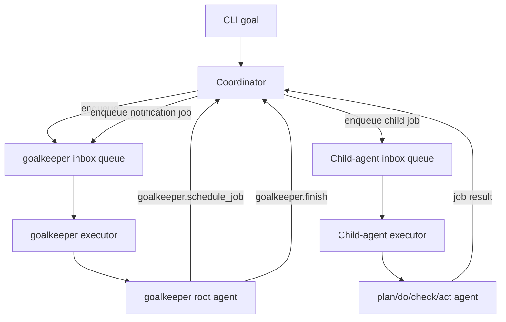

# Goalkeeper Playground

Goalkeeper is an experimental playground feature with two temporary command surfaces:

- `norma playground goalkeeper <goal>`: synchronous root-agent playground
- `norma playground goalkeeper-notify <goal>`: async queue-based playground

Goalkeeper is **PDCA-inspired**, not the structured PDCA contract implementation used by `norma loop`. The real PDCA runtime is documented in [PDCA Loop](pdca-agent.md).

## What Goalkeeper Is

Goalkeeper uses the role names `plan`, `do`, `check`, and `act`, but today it runs them as long-lived Codex ACP-backed agents with:

- fixed injected role instructions
- freeform per-job task text
- freeform text outputs
- debug lifecycle logging around job dispatch and completion

Goalkeeper does **not** currently implement:

- structured PDCA role JSON contracts
- real harness-level `continue` or `replan` semantics
- Beads integration
- the older fixed-DAG `depends_on` kernel model

All Goalkeeper agents are fixed to:

- agent type: `codex_acp`
- model: `gpt-5.3-codex`

`--bridge-bin` is optional and only overrides the executable used for the fixed Codex ACP bridge. When omitted, Goalkeeper uses:

```bash
npx -y @normahq/codex-acp-bridge@latest
```

Stdout is reserved for the final `goalkeeper` answer. Root-agent lifecycle messages use structured zerolog at info level. Per-job envelopes and child-agent output are debug-only.

## `goalkeeper`

The synchronous playground is a single `goalkeeper` turn backed by one MCP tool:

```bash
norma playground goalkeeper "ship the goal" \
  --bridge-bin /path/to/codex-acp-bridge \
  --max-tool-calls 8
```

Behavior:

- the root agent named `goalkeeper` receives one `GOAL JOB`
- `goalkeeper` can run child-agent work only through `goalkeeper.run_job`
- `goalkeeper.run_job` runs one prompt turn on exactly one child agent
- each child agent keeps its ADK session for the command lifetime
- runtime routing is by `locator`, not by role

This command is a playground approximation of PDCA role orchestration. It is not the same thing as the structured PDCA loop in `norma loop`.

### `goalkeeper.run_job`

Tool input:

```json
{
  "job_id": "job-plan",
  "locator": { "type": "agent", "id": "plan" },
  "reply_to": { "type": "agent", "id": "goalkeeper" },
  "task": "Plan how to satisfy the GOAL job."
}
```

Tool output:

```json
{
  "job_id": "job-plan",
  "locator": { "type": "agent", "id": "plan" },
  "reply_to": { "type": "agent", "id": "goalkeeper" },
  "status": "completed",
  "result": "..."
}
```

The tool rejects unknown child-agent locators, empty job IDs, empty tasks, unsupported locator types, and calls beyond `--max-tool-calls`.

Example debug send envelope:

```json
{
  "level": "debug",
  "direction": "send",
  "job_id": "job-plan",
  "locator": { "type": "agent", "id": "plan" },
  "reply_to": { "type": "agent", "id": "goalkeeper" },
  "task": "Plan how to satisfy the GOAL job.",
  "message": "job envelope"
}
```

Example debug receive envelope:

```json
{
  "level": "debug",
  "direction": "receive",
  "job_id": "job-plan",
  "locator": { "type": "agent", "id": "plan" },
  "reply_to": { "type": "agent", "id": "goalkeeper" },
  "status": "completed",
  "result": "...",
  "message": "job envelope"
}
```

## `goalkeeper-notify`

The async playground keeps the same four child-agent names, but changes the harness shape:

```bash
norma playground goalkeeper-notify "ship the goal" \
  --bridge-bin /path/to/codex-acp-bridge \
  --max-tool-calls 8
```

Current implementation:

- a code Coordinator owns scheduling
- every logical agent has an inbox queue
- one serial executor drains each inbox queue
- worker completions are reported back to the Coordinator
- the Coordinator creates `goalkeeper` notification jobs
- the `goalkeeper` root agent reacts to those notifications with more scheduling or `goalkeeper.finish`

This is still a playground harness, not the structured PDCA runtime used by `norma loop`.

### Current limitations

- runtime routing is target-agnostic through `locator` and `reply_to`
- worker job payloads are freeform text
- completion notifications are structured envelopes delivered as prompt text
- `act` may say `continue` or `replan` in prose, but those are not harness-level control states today
- the current harness finishes when `goalkeeper` calls `goalkeeper.finish`
- jobs are in-memory only for this playground

### Async execution shape



### `goalkeeper.schedule_job`

Tool input:

```json
{
  "job_id": "job-plan",
  "locator": { "type": "agent", "id": "plan" },
  "reply_to": { "type": "agent", "id": "goalkeeper" },
  "task": "Plan how to satisfy the GOAL job."
}
```

Tool output:

```json
{
  "job_id": "job-plan",
  "locator": { "type": "agent", "id": "plan" },
  "reply_to": { "type": "agent", "id": "goalkeeper" },
  "status": "queued",
  "message": "job queued"
}
```

### `goalkeeper.finish`

Tool input:

```json
{
  "summary": "Goal handled."
}
```

Tool output:

```json
{
  "status": "finished",
  "summary": "Goal handled."
}
```

Notification envelopes delivered back to `goalkeeper` include:

```json
{
  "type": "job_completion",
  "source_job_id": "job-plan",
  "source_locator": { "type": "agent", "id": "plan" },
  "reply_to": { "type": "agent", "id": "goalkeeper" },
  "status": "completed",
  "result": "..."
}
```

Debug logs for `goalkeeper-notify` include:

- `job enqueued`
- `job started`
- `job completed`
- `job failed`
- `notification job created`
- `notification job received`

## Relation to Real PDCA

Use [PDCA Loop](pdca-agent.md) for the real contract and runtime semantics:

- structured `input.json -> output.json` role contracts
- lowercase control literals: `pass|fail`, `close|continue|replan`, `passed|failed|stopped`
- session-backed iterative PDCA loop behavior

Use Goalkeeper docs only for the experimental playground command surfaces.
