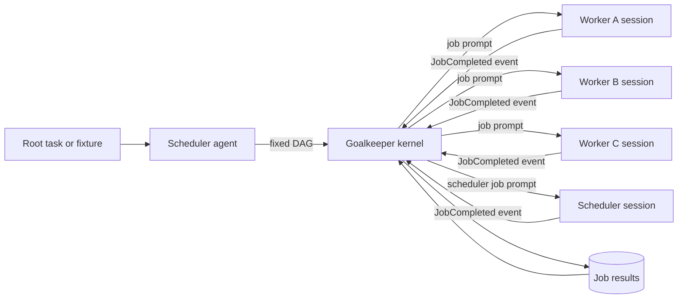
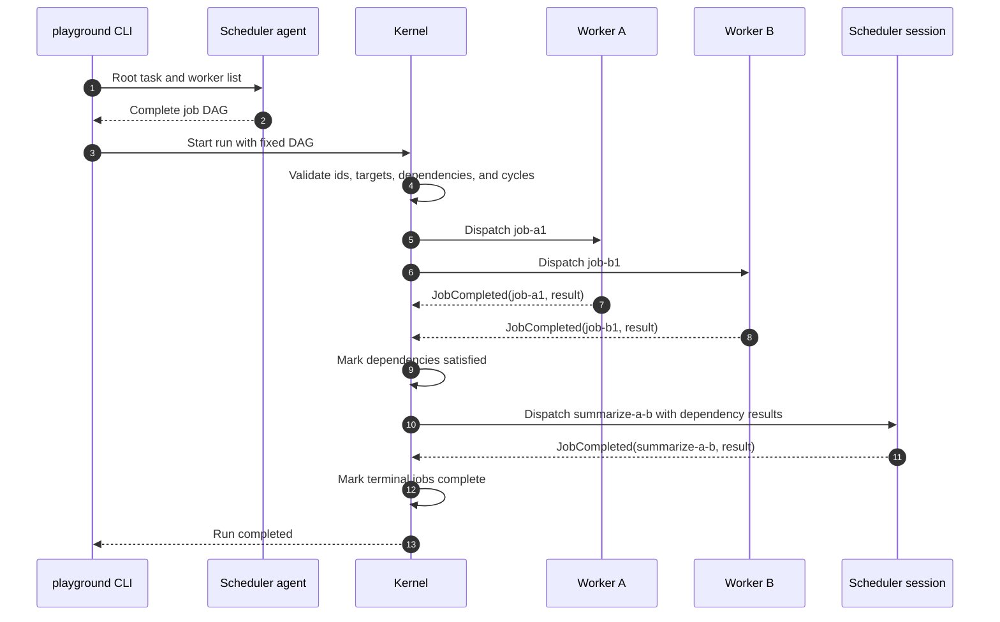
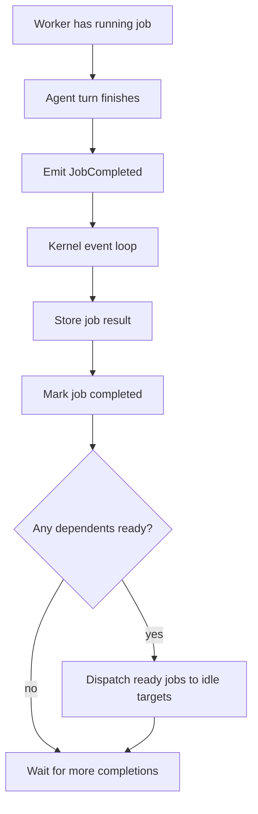
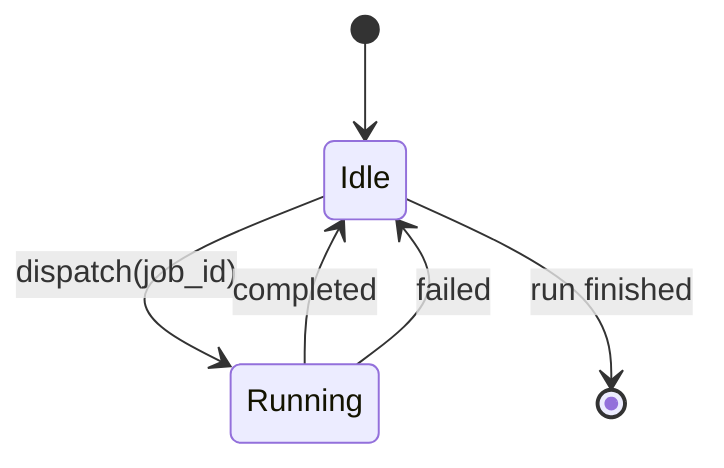
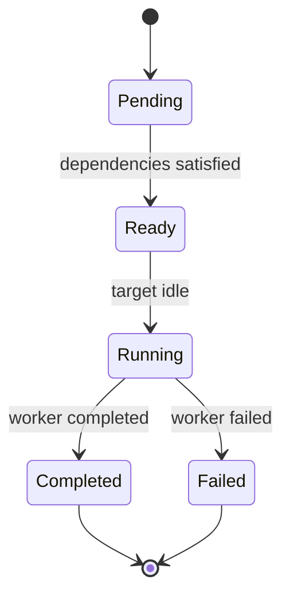

# Goalkeeper Scheduler

Goalkeeper is an experimental playground feature for a fixed-DAG worker scheduler.

The MVP is intentionally static: the scheduler agent runs once at the start, produces the complete job DAG, and then the deterministic kernel executes that DAG to completion. Workers do not create jobs, and worker output never mutates the DAG directly.

Future command surface:

```bash
norma playground goalkeeper "ship the goal"
```

The first playground CLI should be temporary and local. It should not use Temporal.io, Beads, or the production `norma swarm` assignee model.

## PDCA Playground MVP

The first implementation is a fixed PDCA scheduler:

- the root scheduler is a Codex ACP-backed agent
- the Codex ACP backend is fixed to `codex_acp` with model `gpt-5.3-codex`
- the scheduler receives one GOAL job
- the scheduler has four Codex ACP-backed role agents: `plan`, `do`, `check`, and `act`
- the scheduler can run role work only by calling the `goalkeeper.run_job` tool
- `goalkeeper.run_job` runs one prompt turn on exactly one role agent and returns the text result
- each role agent keeps its ADK session for the command lifetime

The scheduler chooses when to call the tool, but its instructions constrain the path to:

```text
plan -> do -> check -> act
```

Command flags:

```bash
norma playground goalkeeper "ship the goal" \
  --bridge-bin /path/to/codex-acp-bridge \
  --max-tool-calls 8
```

`--bridge-bin` is optional and only overrides the executable used for the fixed Codex ACP bridge. When omitted, Goalkeeper uses:

```bash
npx -y @normahq/codex-acp-bridge@latest
```

Stdout is reserved for the final scheduler answer. Scheduler lifecycle messages use structured zerolog at info level. Per-job dispatch/completion/error messages and role-agent output produced during job execution are emitted only at debug level.

### `goalkeeper.run_job`

The scheduler receives this MCP tool:

```json
{
  "job_id": "job-plan",
  "role": "plan",
  "task": "Plan how to satisfy the GOAL job."
}
```

Tool output:

```json
{
  "job_id": "job-plan",
  "role": "plan",
  "status": "completed",
  "result": "..."
}
```

The tool rejects unknown roles, empty job IDs, empty tasks, and calls beyond `--max-tool-calls`.

## Architecture



Responsibilities:

- Scheduler agent creates the complete DAG before execution starts.
- Goalkeeper kernel validates the DAG, owns job state, dispatches ready jobs, and records results.
- Worker agents are long-lived for one run and process one job at a time.
- Scheduler session is just another long-lived agent target. It receives results only through predefined DAG jobs.

## Fixed DAG Lifecycle



The scheduler agent is not notified out of band after every worker result. If the scheduler must inspect results, the initial DAG must contain a scheduler-targeted job that depends on those worker jobs.

## Async Completion Flow



Worker completion event:

```json
{
  "job_id": "job-a1",
  "agent": "agent-a",
  "status": "completed",
  "result": "foobar"
}
```

The kernel consumes this event immediately. Downstream jobs receive the result only when their dependencies are satisfied and they are dispatched.

## Worker State



Rules:

- A worker has one state: `idle` or `running(job_id)`.
- A worker can run only one job turn at a time.
- A ready job targeting a busy worker waits until that worker becomes idle.
- Worker sessions live for the whole run.

## Job State



Rules:

- A job is immutable after validation.
- A job can run only after all `depends_on` jobs are completed.
- A job can target a named worker or the scheduler session.
- A failed job ends the MVP run unless the fixed DAG explicitly models a recovery path.

## MVP Job Shape

```json
{
  "id": "job-a1",
  "target": "agent-a",
  "prompt": "Do this one turn of work.",
  "depends_on": []
}
```

Example fan-in job:

```json
{
  "id": "summarize-a-b",
  "target": "scheduler",
  "prompt": "Summarize dependency results from job-a1 and job-b1.",
  "depends_on": ["job-a1", "job-b1"]
}
```

## Validation Rules

Goalkeeper must fail before dispatch when:

- a job id is empty or duplicated
- a dependency references an unknown job
- the DAG has a cycle
- a target references an unknown worker
- a job prompt is empty

## Out of Scope

- Dynamic job creation after the initial DAG.
- Worker-created jobs.
- Direct worker-to-worker communication.
- Beads state integration.
- Production `norma swarm` replacement.
- Temporal.io workflows.
