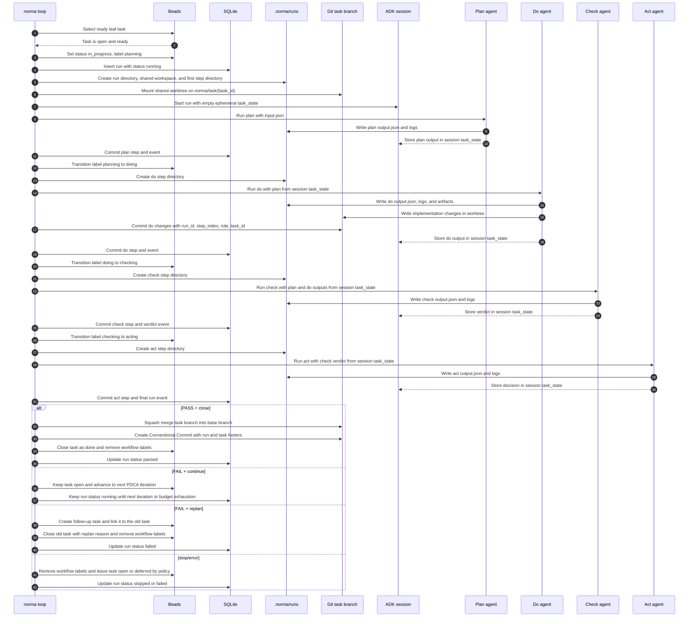

# PDCA Loop

This document describes Norma's fixed execution loop:

`plan -> do -> check -> act`

The loop repeats until the task is completed (`verdict=PASS` + `decision=close`) or a stop condition is reached.

## Scope

- Single workflow only: no alternative orchestration graph.
- One task at a time per run.
- Each step is contract-driven: `input.json -> output.json`.

## Control Semantics

PDCA has three separate control concepts. They are intentionally not interchangeable.

| Concept | Emitted by | Question answered | Valid literals |
| --- | --- | --- | --- |
| Check verdict | Check agent | Is the task complete? | `PASS`, `FAIL` |
| Act decision | Act agent | What should Norma do with that verdict? | `close`, `continue`, `replan` |
| Run status | Norma orchestrator | How did this run end? | `passed`, `failed`, `stopped` |

Casing is part of the contract:
- Verdict literals are uppercase: `PASS`, `FAIL`.
- Decision literals are lowercase: `close`, `continue`, `replan`.
- Run status literals are lowercase: `passed`, `failed`, `stopped`.
- Prose may say pass/fail/close/replan, but JSON examples and contract tables MUST use exact literal casing.

### Decision Matrix

| Check verdict | Legal Act decision | Norma behavior | Final run status |
| --- | --- | --- | --- |
| `PASS` | `close` | Apply task-branch changes, create the final commit, close the task. | `passed` |
| `FAIL` | `continue` | Keep the task open and run the next PDCA iteration from the task branch. | Still running; if the loop exhausts, `failed` |
| `FAIL` | `replan` | Stop this task, create/link replacement work, close the old task with a replan reason. | `failed` |

### Invalid Combinations

These are agent contract violations. Norma must fail the Act step, stop the run, and must not apply workspace changes.

| Invalid output | Why invalid |
| --- | --- |
| `PASS` + `continue` | A passed task is complete; it must close. |
| `PASS` + `replan` | A passed task does not need replacement work. |
| `FAIL` + `close` | A failed task is not complete and cannot be closed as done. |
| Any `rollback` decision | `rollback` is not a PDCA Act decision. |

Human reading guide:
- Check answers: “is the task complete?”
- Act answers: “what should Norma do with that result?”
- Run status records: “how did this run end?”

## Target Simplified Sequence

This target keeps the four PDCA roles, but simplifies durable state:

- Beads stores task/backlog status and visible workflow labels only.
- The ADK session holds ephemeral `task_state` for role-to-role handoff during one live run.
- SQLite and `.norma/runs` store same-machine run, step, event, and artifact history.
- The task branch `norma/task/<task_id>` is the durable implementation history.
- Beads notes are not used as Norma machine state.
- `norma-has-plan`, `norma-has-do`, and `norma-has-check` are not used for resume.



## Iteration Flow

### 1) Plan

Purpose:
- refine the selected task into an executable plan for this iteration
- define acceptance criteria and verification checks

Expected output:
- `plan_output.acceptance_criteria`
- `plan_output.do_steps`

### 2) Do

Purpose:
- execute only planned implementation steps
- produce artifacts and code changes inside the shared run workspace

Expected output:
- `do_output.executed_step_ids`

### 3) Check

Purpose:
- verify plan-vs-execution match
- verify acceptance criteria
- produce verdict

Expected output:
- `check_output.acceptance_results`
- `check_output.verdict` (`PASS|FAIL`)

Verdict rules:
- Any failed acceptance result -> `FAIL`
- Any plan mismatch, missing verification, or incomplete acceptance evaluation -> `FAIL`
- Otherwise -> `PASS`

Current schema note:
- `check_output.plan_match` is not part of the current `check/output.schema.json`.
- `do_output.execution.commands` is not part of the current `do/output.schema.json`.

### 4) Act

Purpose:
- decide what happens next from check verdict

Expected output:
- `act_output.decision` (`close|continue|replan`)

Agent rules:
- If `act_input.verdict == "PASS"`, Act MUST return `decision="close"`.
- If `act_input.verdict == "FAIL"`, Act MUST return `decision="continue"` or `decision="replan"`.
- Act MUST NOT return `decision="rollback"`.
- Act MUST NOT apply changes. Norma applies changes only after valid `PASS` + `close`.

Act behavior:
- `close`: legal only with `PASS`; Norma applies changes and closes the task.
- `continue`: legal only with `FAIL`; Norma runs another PDCA iteration from the task branch.
- `replan`: legal only with `FAIL`; Norma creates replacement work and ends the current run as `failed`.

## Workspaces and Artifacts

- Every step runs in its own step directory:
  - `.norma/runs/<run_id>/steps/<NNN-role>/`
- Every run has one shared git worktree:
  - `.norma/runs/<run_id>/workspace`
- Every role receives that shared path as `paths.workspace_dir`.
- Step files:
  - `input.json`
  - `output.json`
  - `logs/stdout.txt`
  - `logs/stderr.txt`
  - `logs/events.log` (ADK event stream as JSONL)

## State Model

Authoritative state split:
- Backlog/task state: Beads (`bd`) status and visible workflow labels
- Run/step timeline: SQLite (`.norma/norma.db`)
- Human-readable artifacts: filesystem under `.norma/runs/`
- Durable implementation history: git branch `norma/task/<task_id>`

`TaskState` is ephemeral ADK session state for one live run. Beads notes are not used for Norma machine state.

## Stop Conditions

Norma stops the loop when any applies:
- budget exceeded
- dependency blocked
- verification missing/unrunnable
- replan required
- explicit terminal decision (`decision=close` or `decision=replan`)

Stop reason must be represented in step output (`status=stop` with concrete `stop_reason`) when applicable.

## Provider Routing Policy

Norma uses the **Agent Control Protocol (ACP)** for all agent communications. Agents are executed as ephemeral runtimes per step and wrapped with a **structured I/O layer** that ensures compliance with the role-specific JSON contracts.

- Supported standard aliases: `gemini_acp`, `opencode_acp`, `codex_acp`, `copilot_acp`, `claude_code_acp`.
- Custom agents: `generic_acp` (any binary implementing the ACP protocol).
- Execution: Each PDCA step creates a fresh agent instance, executes a single turn with mapped JSON input, and closes the runtime after validating the JSON output.

## Pool Agents (Ordered Failover)

Norma supports **pool agents** that provide ordered failover across multiple ACP agent implementations. Pool agents are useful when you want automatic fallback from a primary agent to backup agents.

### Configuration

Pool agents are configured with `type: pool` and a `pool.members` list of agent IDs to try in order:

```yaml
norma:
  agents:
    primary_agent:
      type: gemini_acp
      gemini_acp:
        model: gemini-3-flash-preview
    fallback_agent:
      type: opencode_acp
      opencode_acp:
        model: opencode/big-pickle
    my_pool:
      type: pool
      pool:
        members:
          - primary_agent
          - fallback_agent
```

### Behavior

- **Ordered sequential attempts**: Pool agents try each member in order (first to last).
- **Failover trigger**: Failover occurs only on runtime/invocation failure before a valid response is produced.
- **All-fail behavior**: If all pool members fail, the returned error includes aggregated failure details from each attempt.
- **Nested pools**: NOT allowed (MVP constraint).
- **Self-reference**: NOT allowed.

### Usage in Profiles

Pool agents can be used anywhere a regular agent is used:

```yaml
cli:
  pdca:
    plan: my_pool
    do: my_pool
    check: my_pool
    act: my_pool
  planner: my_pool
```

### Observability

When all pool members fail, the error message includes:
- Pool name
- Number of attempts
- Each member's error message in order

Example error:
```
pool "my_pool": all 2 members failed
  [1] primary_agent: create agent "primary_agent": ...
  [2] fallback_agent: create agent "fallback_agent": ...
```

## MCP Servers Configuration

Norma supports configuring **MCP (Model Context Protocol) servers** that can be referenced by agents. MCP servers provide additional tools and capabilities to agents that support them.

### Configuration

MCP servers are defined in `norma.mcp_servers`, and agents reference them by name:

```yaml
norma:
  mcp_servers:
    my_mcp_server:
      type: stdio
      cmd: ["npx", "-y", "@example/mcp-server"]
      args: ["--arg1", "value1"]
      env:
        API_KEY: ${API_KEY}
      working_dir: /path/to/workdir

  agents:
    my_agent:
      type: gemini_acp
      gemini_acp:
        model: gemini-3-flash-preview
      mcp_servers:
        - my_mcp_server
```

### Transport Types

- **stdio**: Local subprocess communication via stdin/stdout
  - Requires `cmd` (executable) and optional `args`, `env`, `working_dir`
- **http**: HTTP transport for remote MCP servers
  - Requires `url` and optional `headers`
- **sse**: Server-Sent Events transport
  - Requires `url` and optional `headers`

### Agent References

Agents can reference MCP servers in two ways:

- **Single server**: `mcp_servers: server_name` (string)
- **Multiple servers**: `mcp_servers: [server1, server2]` (array)

Pool agents automatically pass MCP server configurations to their member agents.

## References

- Canonical workflow and contracts: `AGENTS.md`
- Schemas:
  - `internal/agents/pdca/roles/plan/*.schema.json`
  - `internal/agents/pdca/roles/do/*.schema.json`
  - `internal/agents/pdca/roles/check/*.schema.json`
  - `internal/agents/pdca/roles/act/*.schema.json`

## RoleAgent Architecture

The PDCA system uses the `roleagent` package for implementation-agnostic role execution. This abstraction allows roles to be reused across different workflow types.

### Core Components

- **`roleagent.RoleContract`**: Interface that all roles must implement:
  - `Name() string` - Role identifier
  - `Schemas() SchemaPair` - Input/output JSON schemas
  - `Prompt(req AgentRequest) (string, error)` - Generate agent prompt
  - `MapRequest(req AgentRequest) (any, error)` - Transform input for role
  - `MapResponse(outBytes []byte) (AgentResponse, error)` - Parse agent output

- **`roleagent.AgentRequest`**: JSON raw message (`json.RawMessage`) containing the full input for the role

- **`roleagent.AgentResponse`**: Standardized response structure with role-specific outputs as JSON raw messages:
  - `PlanOutput`, `DoOutput`, `CheckOutput`, `ActOutput` - Role-specific data

### PDCA Composition

The PDCA roles compose the roleagent abstraction:

1. **`roles/base_role.go`**: Implements `RoleContract` with common prompt/schema handling
2. **`roles/roles.go`**: Defines role-specific `MapRequest`/`MapResponse` for plan, do, check, act
3. **`runner.go`**: Executes roles via `roleagent.Executor` with structured I/O
4. **`agent.go`**: Orchestrates the PDCA loop using the role system

### Migration Rationale

Previously, PDCA used `contracts.Role` interface with typed structs. The migration to `roleagent.RoleContract`:
- Removes PDCA-specific adapter layer
- Enables role reuse in non-PDCA workflows
- Maintains backward compatibility through JSON serialization
- Simplifies the executor integration
