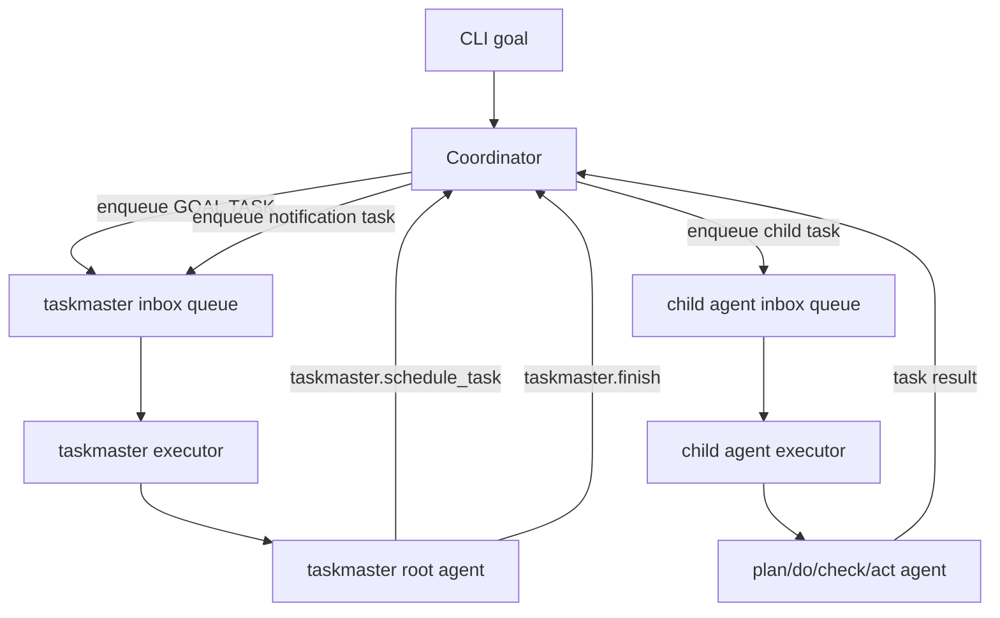

# Taskmaster Playground

Taskmaster is an experimental async harness exposed as:

```bash
norma playground taskmaster "ship the goal" \
  --bridge-bin /path/to/codex-acp-bridge
```

Taskmaster is an experimental async harness that now runs a **strict PDCA prompt contract** on top of its queue-based runtime. It is still not the same thing as the structured PDCA runtime used by `norma loop`. The real PDCA contracts and loop semantics are documented in [PDCA Loop](pdca-agent.md).

## What It Is

Taskmaster boots one root agent named `taskmaster` plus four fixed child agents:

- `plan`
- `do`
- `check`
- `act`

All of them are fixed to:

- agent type: `codex_acp`
- model: `gpt-5.3-codex`

This playground currently uses:

- one inbox queue per agent
- one serial executor per inbox
- coordinator-owned task scheduling
- target-agnostic routing through `locator`
- async completion routing through `report_to`
- strict root-agent PDCA sequencing by prompt contract
- freeform task text and freeform text outputs

This playground does **not** currently implement:

- structured PDCA JSON role contracts
- harness-level `continue` control states
- persistence or retries
- non-agent locator types
- Beads-backed orchestration state

When `--bridge-bin` is omitted, Taskmaster uses:

```bash
npx -y @normahq/codex-acp-bridge@latest
```

Stdout is reserved for the final `taskmaster` answer. Lifecycle logs, task envelopes, and child-agent output are debug-only.

## Runtime Shape

At runtime, the harness routes **tasks**, not roles. `plan`, `do`, `check`, and `act` are fixed startup-configured agent ids in this MVP, and the root `taskmaster` agent is instructed to run them in strict PDCA order within each iteration:

`plan -> do -> check -> act`

Core pieces:

- `taskmaster` root agent
- Coordinator
- one inbox queue per agent
- one executor per agent inbox
- MCP tools:
  - `taskmaster.schedule_task`
  - `taskmaster.finish`

Flow:



## Prompt Contract

The current prompt layer is strict PDCA:

- the root `taskmaster` instruction requires `plan -> do -> check -> act`
- every new goal starts with `plan`
- child-agent I/O is plain text, not structured role payloads
- `check` and `act` are interpreted semantically by the root agent from their text output
- helpful text labels like `verdict:` or `decision:` are optional conventions, not required protocol
- an act output that clearly recommends `close` means `taskmaster.finish`
- an act output that clearly recommends `replan` means more planning is required before further execution
- the root `taskmaster` agent decides what to schedule next from the prompt text it receives; child outputs are advisory, not direct runtime commands

This sequencing is enforced by prompt contract, not by a coordinator phase-state machine.

Important boundary:

- Taskmaster runtime tasks internally carry `prompt` plus routing state.
- Agents do **not** receive that envelope object.
- The runtime passes only the envelope `prompt` into the actual agent turn.
- Routing data such as `locator` and `report_to` stays in the coordinator/tool layer.
- Root `taskmaster` is a handoff coordinator, not a pseudo-worker author.
- Root `taskmaster` must not invent worker methodology, command examples, acceptance criteria, or execution guidance for child agents.
- Child methodology lives in the child agent system prompts.
- When multiple upstream texts are needed, root may use only neutral separators such as `Goal:`, `Plan output:`, `Do output:`, and `Check output:`.
- Child agents are expected to answer in simple plain text. Taskmaster does not require JSON, role field names, or fenced structured blobs.

## Routing Model

Task routing is locator-based.

Current MVP locator shape:

```json
{
  "type": "agent",
  "id": "plan"
}
```

Every runtime task also carries `report_to`, which tells the Coordinator where task completion should be reported. If omitted in `taskmaster.schedule_task`, it defaults to:

```json
{
  "type": "agent",
  "id": "taskmaster"
}
```

## `taskmaster.schedule_task`

Tool input:

```json
{
  "task_id": "task-plan",
  "locator": { "type": "agent", "id": "plan" },
  "report_to": { "type": "agent", "id": "taskmaster" },
  "prompt": "count lines of go code"
}
```

Tool output:

```json
{
  "task_id": "task-plan",
  "locator": { "type": "agent", "id": "plan" },
  "report_to": { "type": "agent", "id": "taskmaster" },
  "status": "queued",
  "message": "task queued"
}
```

Validation rules:

- `task_id` must be non-empty and unique within the run
- `prompt` must be non-empty
- `locator.type` must be `agent`
- `locator.id` must be one of `plan|do|check|act`
- `report_to.type` must be `agent`
- `report_to.id` must be a known runtime agent id

## `taskmaster.finish`

Tool input:

```json
{
  "summary": "Goal handled."
}
```

Tool output:

```json
{
  "status": "finished",
  "summary": "Goal handled."
}
```

`taskmaster.finish` marks the run terminal, but the harness still waits for the currently running `taskmaster` turn to return before the command exits.

## Completion Prompts

When a non-root task completes, the Coordinator creates a new notification task addressed to the original `report_to`.

The runtime keeps completion metadata internally, but the root agent receives only a plain prompt, for example:

```text
Task task-plan completed.

Result:
...
```

## Debug Logs

Debug lifecycle logs include:

- `task enqueued`
- `task started`
- `task completed`
- `task failed`
- `notification task created`
- `notification task received`

## Relation to Real PDCA

Use [PDCA Loop](pdca-agent.md) for the real runtime:

- structured `input.json -> output.json` role contracts
- orchestrated PDCA iteration semantics
- branch/workspace integration
- Beads-backed task selection and completion flow

Use Taskmaster docs only for the experimental async playground harness.
