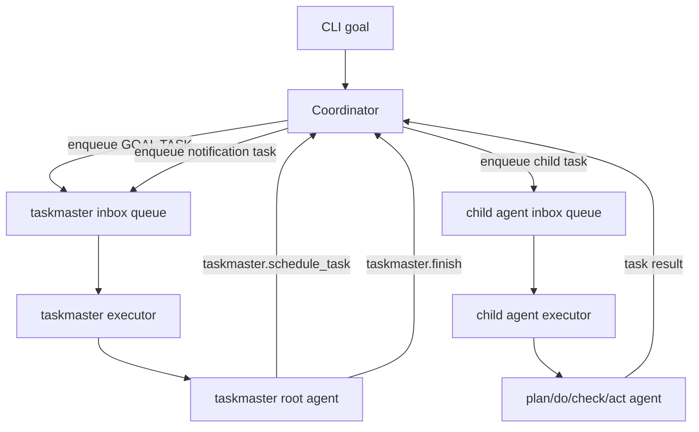

# Taskmaster Playground

Taskmaster is an experimental async harness exposed as:

```bash
norma playground taskmaster "ship the goal" \
  --bridge-bin /path/to/codex-acp-bridge \
  --max-tool-calls 8
```

Taskmaster is **PDCA-inspired**, not the structured PDCA runtime used by `norma loop`. The real PDCA contracts and loop semantics are documented in [PDCA Loop](pdca-agent.md).

## What It Is

Taskmaster boots one root agent named `taskmaster` plus four fixed child agents:

- `plan`
- `do`
- `check`
- `act`

All of them are fixed to:

- agent type: `codex_acp`
- model: `gpt-5.3-codex`

This playground currently uses:

- one inbox queue per agent
- one serial executor per inbox
- coordinator-owned task scheduling
- target-agnostic routing through `locator`
- async completion routing through `reply_to`
- freeform task text and freeform text outputs

This playground does **not** currently implement:

- structured PDCA JSON role contracts
- harness-level `continue` or `replan` control states
- persistence or retries
- non-agent locator types
- Beads-backed orchestration state

When `--bridge-bin` is omitted, Taskmaster uses:

```bash
npx -y @normahq/codex-acp-bridge@latest
```

Stdout is reserved for the final `taskmaster` answer. Lifecycle logs, task envelopes, and child-agent output are debug-only.

## Runtime Shape

At runtime, the harness routes **tasks**, not roles. `plan`, `do`, `check`, and `act` are just fixed startup-configured agent ids in this MVP.

Core pieces:

- `taskmaster` root agent
- Coordinator
- one inbox queue per agent
- one executor per agent inbox
- MCP tools:
  - `taskmaster.schedule_task`
  - `taskmaster.finish`

Flow:



## Routing Model

Task routing is locator-based.

Current MVP locator shape:

```json
{
  "type": "agent",
  "id": "plan"
}
```

Every runtime task also carries `reply_to`, which tells the Coordinator where completion notifications must be sent. If omitted in `taskmaster.schedule_task`, it defaults to:

```json
{
  "type": "agent",
  "id": "taskmaster"
}
```

## `taskmaster.schedule_task`

Tool input:

```json
{
  "task_id": "task-plan",
  "locator": { "type": "agent", "id": "plan" },
  "reply_to": { "type": "agent", "id": "taskmaster" },
  "task": "Plan how to satisfy the GOAL TASK."
}
```

Tool output:

```json
{
  "task_id": "task-plan",
  "locator": { "type": "agent", "id": "plan" },
  "reply_to": { "type": "agent", "id": "taskmaster" },
  "status": "queued",
  "message": "task queued"
}
```

Validation rules:

- `task_id` must be non-empty and unique within the run
- `task` must be non-empty
- `locator.type` must be `agent`
- `locator.id` must be one of `plan|do|check|act`
- `reply_to.type` must be `agent`
- `reply_to.id` must be a known runtime agent id
- calls beyond `--max-tool-calls` are rejected

## `taskmaster.finish`

Tool input:

```json
{
  "summary": "Goal handled."
}
```

Tool output:

```json
{
  "status": "finished",
  "summary": "Goal handled."
}
```

`taskmaster.finish` marks the run terminal, but the harness still waits for the currently running `taskmaster` turn to return before the command exits.

## Notification Envelope

When a non-root task completes, the Coordinator creates a new notification task addressed to the original `reply_to`.

Notification prompt payload:

```json
{
  "type": "task_completion",
  "source_task_id": "task-plan",
  "source_locator": { "type": "agent", "id": "plan" },
  "reply_to": { "type": "agent", "id": "taskmaster" },
  "status": "completed",
  "result": "..."
}
```

The root agent receives that payload prefixed as:

```text
TASK ENVELOPE:
...
```

## Debug Logs

Debug lifecycle logs include:

- `task enqueued`
- `task started`
- `task completed`
- `task failed`
- `notification task created`
- `notification task received`

## Relation to Real PDCA

Use [PDCA Loop](pdca-agent.md) for the real runtime:

- structured `input.json -> output.json` role contracts
- orchestrated PDCA iteration semantics
- branch/workspace integration
- Beads-backed task selection and completion flow

Use Taskmaster docs only for the experimental playground harness.
